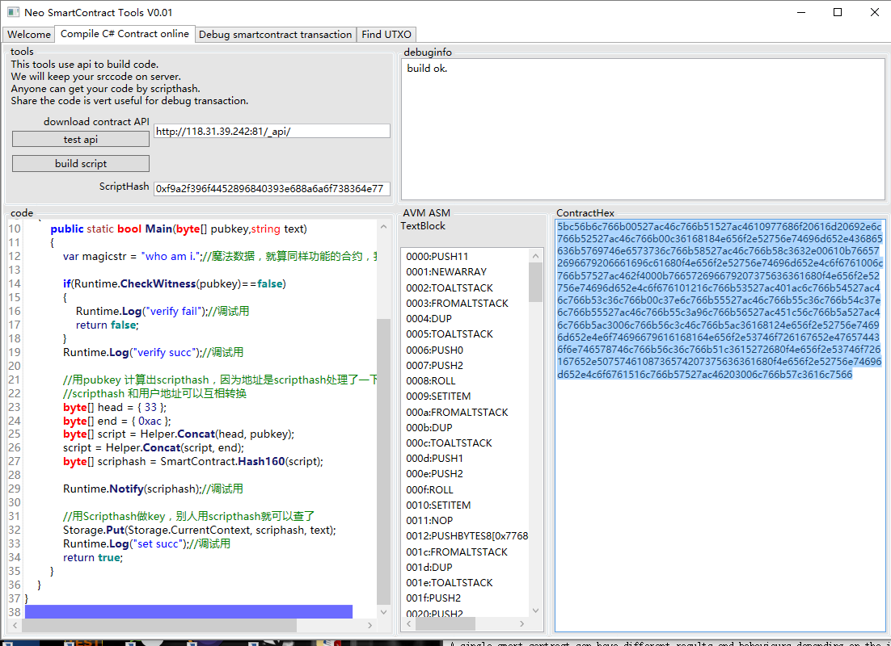
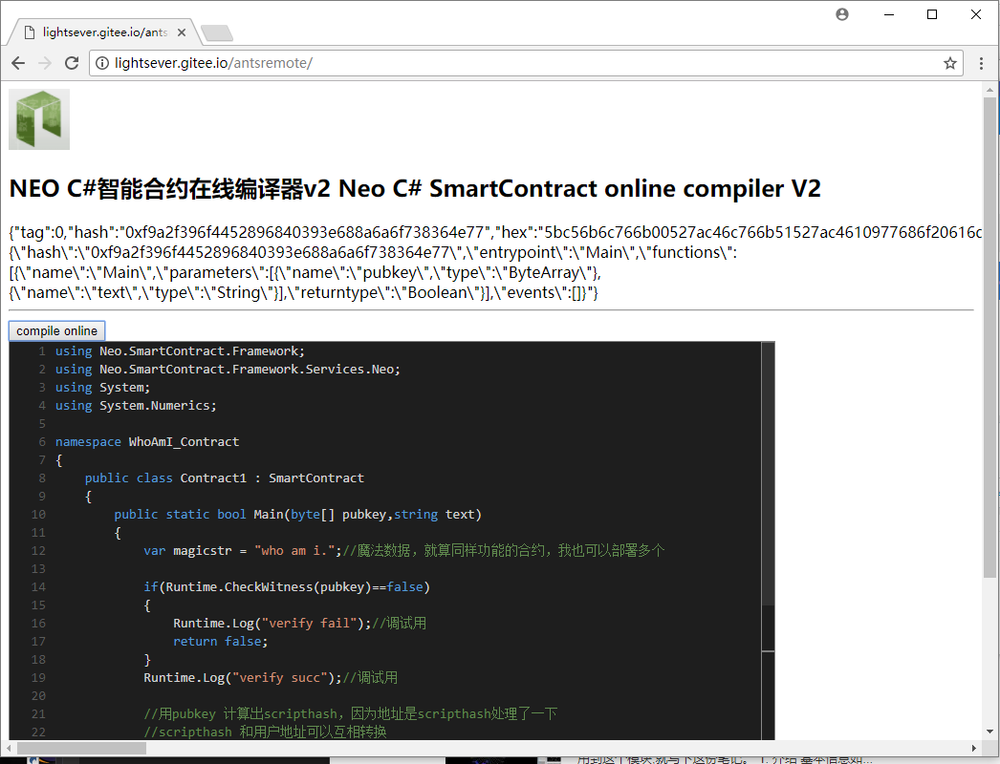
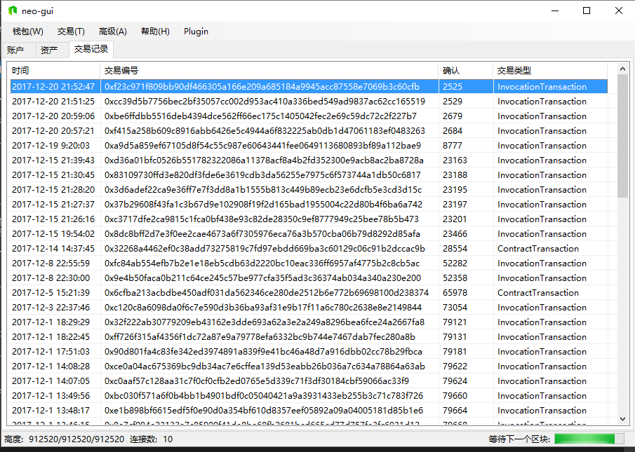
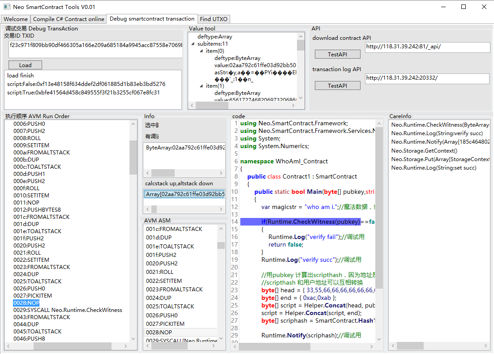

# ScTool_Wpf
[English Document](README_EN.md)

ScTool 是 SmartContract Tools 的简写，是一套NEO智能合约调测工具。

ScTool is "SmartContract Tools",is a set of tools for develop neo smartcontracts.

嗯，他是一套工具。包含两组服务器和前端，全部都开源。

er,It is a set of tools.Include servers and clients,and all opensourced.

一组服务器叫做RemoteSharpContractBuilder,暂时存放在SmartContractBrowser 项目中。他能在服务器上编译c#代码

one of our server is called "RemoteSharpContractBuilder",you can find it in "SmartContractBrowser" project.it can compile c# code to avm on server.

另一组服务器是一个定制的 neo cli 节点,暂时存放在neo-gui-nel 项目中。

another server is a special verison of neo-cli,you canfind it in "neo-gui-nel" project.it can make info for debug smartcontract.

目前我们只部署了TestNet的服务API，由于我们的服务器是开发使用，经常会做各种操作。如果你喜欢这套工具，我们建议你自己部署服务。

for now,We just run our spec neo-cli on neo's chain "testnet",you can run your service if you need.

我们直接采用了前后端分离的设计，是因为请求开发Web工具集的呼声很高。
我们已经准备好为Web开发工具集的API。

We use the C/S mode for this tools,beacuse a lot of people asked us to develop a web version tools.
We are ready for web tools now.we will do that later.
 

## Functions

这套工具目前主要有两个功能

now we have this functions:

1.C# online compiler C#在线编译器

将代码复制进来，或者在这里编写。若生成成功，你的源码、avm、abi文件、map文件 会被保存在服务器上。
任何人均可查看。

just write your C# code here,or parse some text.and press the button "build scirpt".
you will got a result if it is successed.
the code\avm file\abi file\map file(map avm code -> src lines) will be saved on server.
everyone can look them.

这个编译器基于远程API工作，所以他可以开发一个Web版本

this compiler depend on a remote api,so we can develop a web tool to compile c# code.

我们建立了一个范例。

this picture is a sample.

最终，我们会提供一整套的Web开发工具。

we will devlop a full set of web tools for Neo， finially.

2.Debug tool,智能合约交易调试工具

另一个功能是针对一个具体的交易，查看他的执行细节

another function is to check a invocation transaction,look the details in it.

如图我们刚刚发起了一笔交易

in this picture,we send a transaction

然后在调试工具中输入交易ID即可查询交易执行的细节。
如果调用链中包含你用我们的C#online编译器编译的合约，我们还能自动帮你下载到源码，并对应。

what you need is just input the txid on the debug tools.
if some smartcontract script is called that is build by onlinebuilder,we can download the srccode for you too.

这里有你需要的一切信息。
执行栈和计算栈上的值在每一步的时候的情况。
有哪些Syscall被调用。
Notify Log 这些都不在话下。

you can got everything,every detail.
every step about avm,every thing on stack and altstack.what syscall had be called.
you can see notify logs,everything.

3.And more 其他可能性

实际上，你也可以利用这套调试工具去开发特色的爬虫，收集NEO区块链上不为人所知的秘密。
我们可以准确的判定一个智能合约交易的行为，完全基于链上真实执行情况。

Acctruly,if you want developer a net spider or sth,this is useful too.
we can look everything in a invocation transaction.you wont miss anything on neo's chain.

## How to use
   
编译功能的使用方法：写代码->按编译按钮->看到结果并自动保存在服务器

how to compile:write code -> press button -> see result (Server will keep your code)

调试功能的使用方法：输入txid->按load按钮->看结果

how to debug:input the txid-> press button -> see what you got.

GoodDay.

