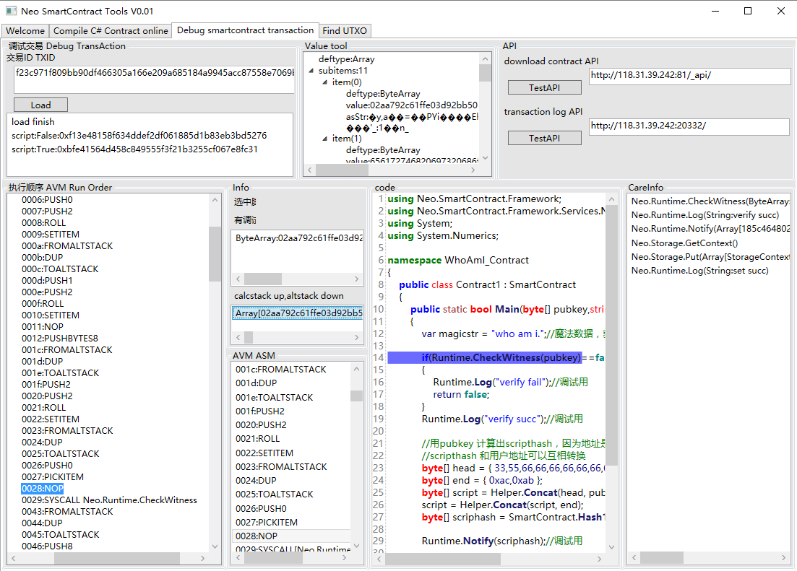

# ScTool_Wpf
[README](README.md)

ScTool is the short form of SmartContract Tools, it is a toolchain for NEO contract development.
They are all open sources with two servers and one client modules. 

One module is called RemoteSharpContractBuilder, you can find it in "SmartContractBrowser" project for compiling c# smart contract to avm.

Another server module is a special version of neo-cli node, you can find it in "neo-gui-nel" project for debugging smartcontract.

We currently just deployed the API for testnet. The current server is for development and will change quite frequently, we recommend  deploying your own server if you found these tools useful.

We use client/server design because there are many requests for NEO smart contract Web development tools. The APIs are all ready for the web development tools.

## Features

These tools have two features

1. C# online compiler

Copy the source code or directly write your code on the client code editor and then press the button "build scirpt". The avm, abi, map files will upload to the server if compile successfully.

Everyone can check the files.

This compiler use remote api, this allow us to develop a web tool for compiling c# code. 

This is our sample.

We will eventually develop a complete web development tools for Neo smart contract.

2. Smart Contract debugging tool

Another function is to check the details of the invoked transaction.

The diagram shows our invoked transaction.

We can check the execution details by entering the transaction txid. You can download the source code if it is written by our online editor.

It contain all information you want including the values of execution and run-time stack, and the Syscall have been made. And of course Notify Log.

3. Other Possibilties

In fact you can use this tool to develop different feature crawler to collect and explore the information on NEO Blockchain. We can examine every transactions based on the real time transaction on the network.

## How to use

Compiler: Write codes on editor -> build script

Debugging: Enter txid and see the results

GoodDay.

